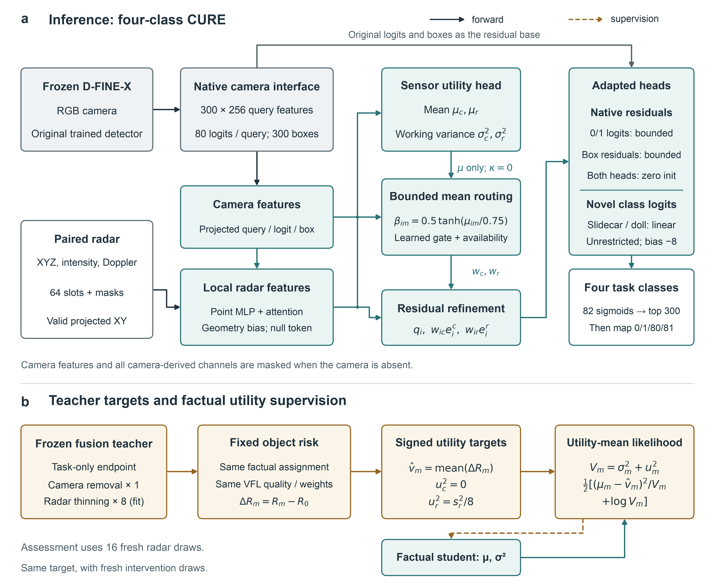
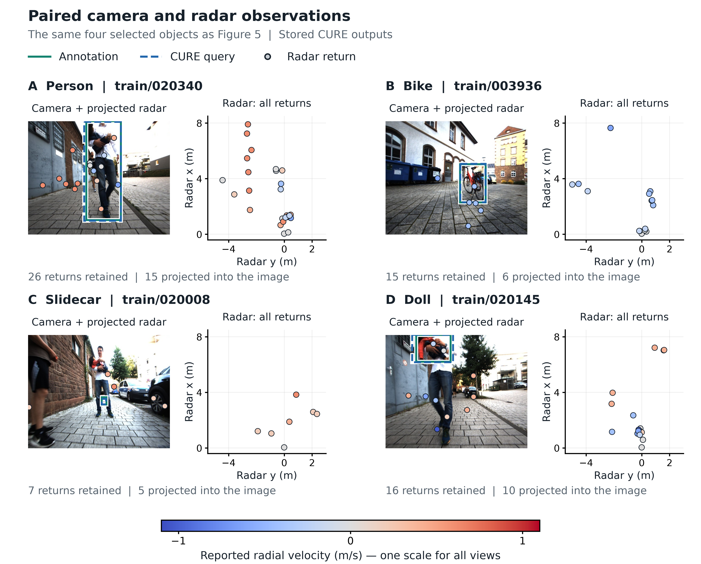

# CURE-Fusion

### Counterfactual Sensor Utility and the Attribution to Routing Gap in Multimodal Detection

[Getting started](SETUP.md) · [Figures](figures/README.md) · [Results](tables/README.md) · [Model code](code/cure_fusion/dfine_cure_v2.py)

**How much does a sensor contribute to a detection—and does that tell us how to use it?**

CURE-Fusion studies this question through Counterfactual Sensor Utility (CSU), a signed measure of how a frozen teacher's object-level loss changes when a modality is removed or perturbed. It combines a camera–radar detection interface, learned utility estimates and a bounded residual controller to examine the relationship between sensor attribution and routing decisions.

<p align="center"></p>

## Research contributions

- **Controlled sensor attribution.** Factual object assignment, classification-quality targets and risk weights are held fixed when forming utility targets, making the loss comparison explicit.
- **Learned object-level utility.** Utility readouts estimate the signed contribution of camera and radar inputs, with comparisons against fitting constants and trained feature readouts.
- **Attribution versus action.** Matched controllers, action-selection studies and a mathematical counterexample distinguish dependence on a sensor from the benefit of changing a routing decision.
- **Camera–radar analysis.** Real paired observations connect the formulation to detection outputs, class-level behavior and computational cost.

## Camera and radar together

<p align="center"></p>

Four recorded scenes show the paired inputs used in the analysis. These are qualitative examples; aggregate comparisons are reported separately. All eight figures are available as [PNG, PDF and SVG](figures/README.md).

## Main findings

On 2,521 objects from eight reused development recordings, camera-utility RMSE is **7.66% lower** than a trained readout on task-only features and **44.99% lower** than a fitting-mean constant. These are post-hoc utility-prediction comparisons, not detection improvements; the feature comparison also changes factual query correspondence.

| Matched detector | Four-class COCO box AP (%) |
| --- | ---: |
| Task-only controller | 62.33 |
| Modality dropout | 61.74 |
| CURE-Fusion | 61.47 |

The central finding is the separation between a learnable removal signal and a useful routing action: the tested controllers do not establish a consistent added AP benefit. The study provides a formulation and diagnostic tools for investigating that distinction. The detection comparison uses one detector seed; action studies use five controller seeds. See the [full results and study conditions](tables/README.md) for all thirteen tables, uncertainty estimates and comparisons.

## Getting started

The CPU example below runs the saved utility analysis and generates the scientific tables. It needs no GPU, dataset download or trained checkpoint.

```sh
git clone https://github.com/isaacodaf/CURE-Fusion.git
cd CURE-Fusion
python3.12 -m venv .venv
source .venv/bin/activate
python -m pip install -r requirements.txt
python reproduce_results.py --skip-figures --output outputs/quickstart
```

Open `outputs/quickstart/REPRODUCTION.json` for the check result and `outputs/quickstart/tables/` for the outputs. Use a new output directory for each run.

**[SETUP.md](SETUP.md)** covers installation, tests, figure generation, evaluation of saved detections, CUDA experiment requirements and troubleshooting. Full training requires the external data, caches and checkpoints listed there.

## Code organization

| Directory | Contents |
| --- | --- |
| [code/cure_fusion/](code/cure_fusion/dfine_cure_v2.py) | Detector adapters, utility objectives, readouts and routing rules |
| [code/scripts/](code/scripts/train_dfine_cure_development_cuda_v2.py) | Experiment launchers |
| [configs/](configs/external_dependencies.json) | Protocols, splits and dependency specifications |
| [analysis/](analysis/utility_metrics.py) | Utility metrics and recording-level statistics |
| [plotting/](plotting/architecture.py) | Figure generation |
| [results/](results/table_views.json) | Scientific result operands and attributed sensor examples |
| [figures/](figures/README.md) | Eight finished figures |
| [tables/](tables/README.md) | Thirteen tables and full-precision results |
| [tests/](tests/test_research_release.py) | Numerical and package checks |

The scientific implementation retains the original `cev_*` tensor names; the paper uses CSU for the corresponding sensor-utility formulation. [SOURCE_MAP.json](SOURCE_MAP.json) records source identities.

## Acknowledgments and data

The detector interfaces build on [D-FINE](https://github.com/Peterande/D-FINE) and [RT-DETR](https://github.com/lyuwenyu/RT-DETR). Camera–radar examples come from the [SEW Multimodal AMR Dataset](https://github.com/SEW-Eurodrive-Open-Source/Multimodal_AMR_dataset). Please retain the applicable upstream and dataset attributions. [NOTICE.md](NOTICE.md) describes the separate dataset-example terms and project-code licensing status.
